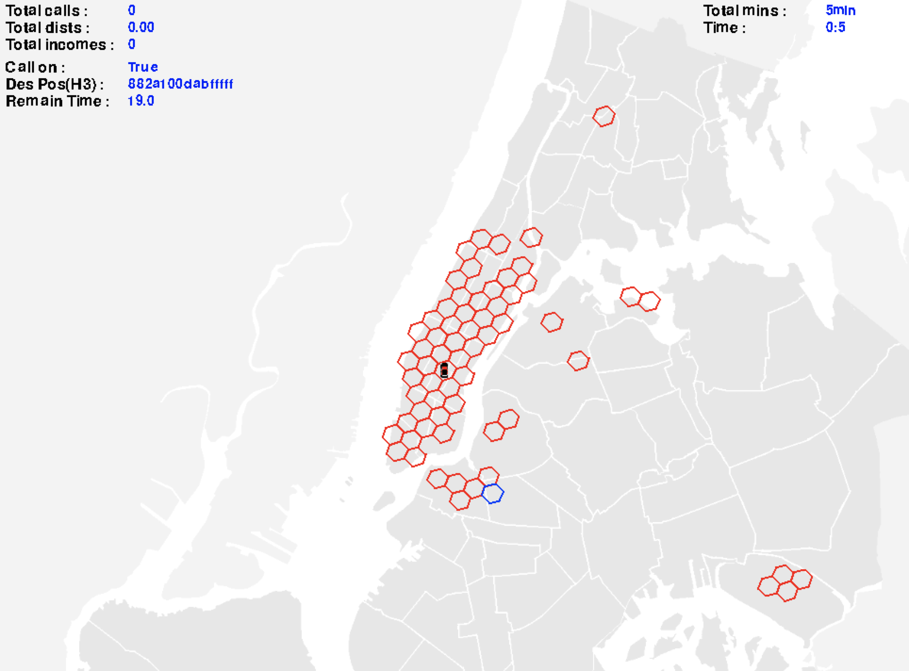
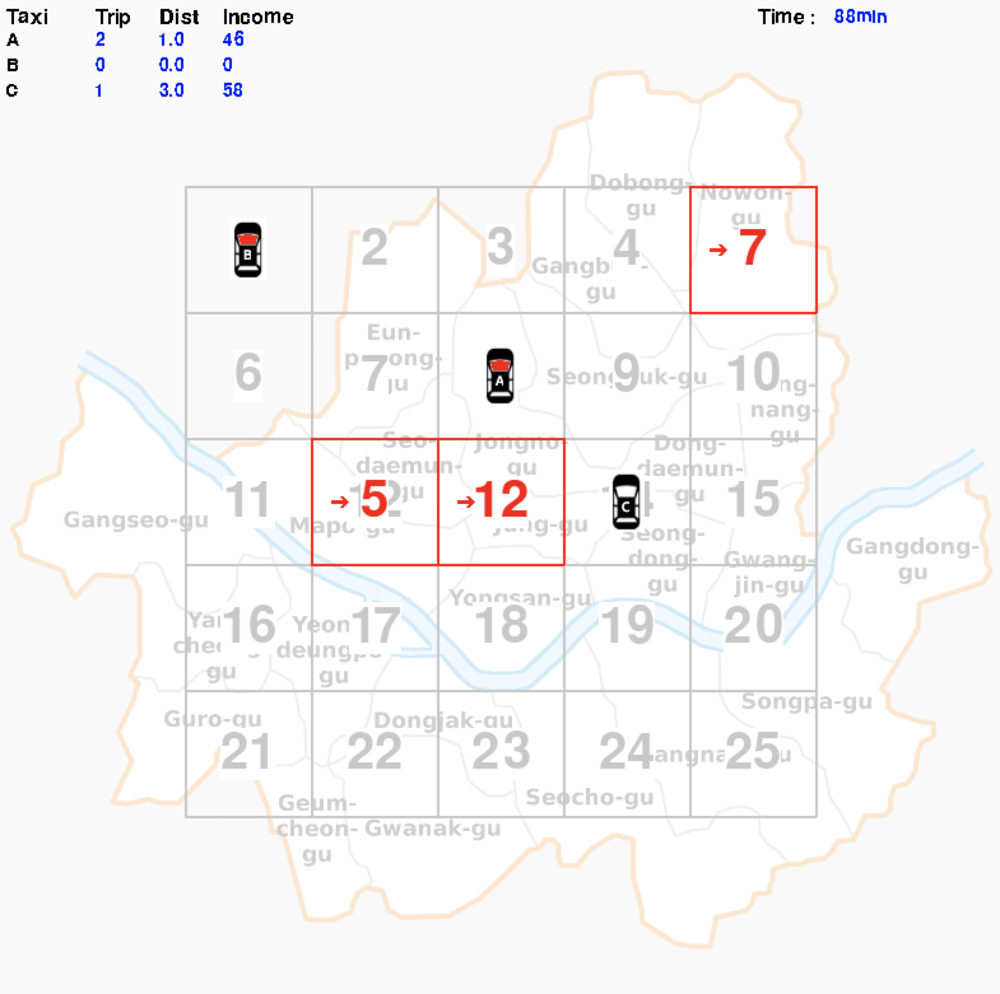
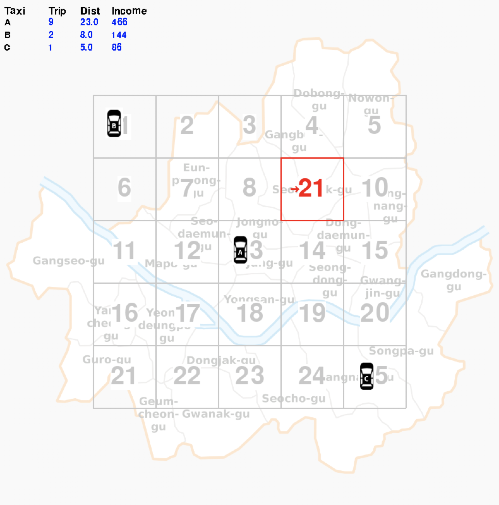

# mobil-gym

### developing environment for taxi-trip simulation


#### Version History

------------------------------

<br>

(5) 2018-10-07 (NYC)
 - Taxi Class Modification
 - Action (random ) based reward
 - Question : Sequence of Actions -> Reward Prediction ?
 - All case reward caculcation?
 - Environment randomness events?

(4) 2018-10-03 (NYC)
 - Taxi moving trajectory added
 - Bug report A. : while waiting -> remain tm update error
 - Bug report B. : when waiting / No call, taxi moving update error
 - Need more ft. : calculate score ( + for income  - for waiting )
 - How to calculate expected score or reward


(3) 2018-09-30 (NYC)

- single taxi sim
- call prob based on real data (NYC May-2016)




(2) 2018-09-17
- Passenger on Taxi ( red light )
- Total time is count
- When taxi arrived in destination the money and trip are counted
- Taxi move to destination (no moving animation )



```

when the taxi is called red light is on and destination position

```


(1) 2018-09-16
- Set Status ( environment stats )
- random call for higher prob of nearby reigon



```

when the taxi is called red light is on and destination position

```
